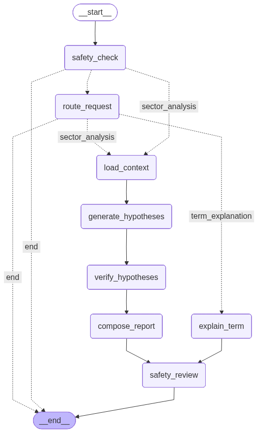

## 서버 실행 가이드

```shell
# 저장소 클론 및 디렉토리 이동
git clone https://github.com/soma17th-ai21/be-ai.git && cd ./be-ai

# .env 파일 생성
cp .env.example .env

###########################################################################
#####       생성된 .env 파일에 네이버 검색 API 키, 업스테이지 API 키 채우기       #####
##### ( `NAVER_CLIENT_ID`, `NAVER_CLIENT_SECRET`, `UPSTAGE_API_KEY` ) #####
###########################################################################

# 의존성 동기화
uv sync

# SQLite DB 초기화
mkdir -p data
uv run python -c 'import asyncio; from app.db.init import init_db; asyncio.run(init_db())'

# 뉴스 데이터와 주가 데이터 수집
uv run python -m app.ingestion.manual_collect

# FastAPI 서버 실행
uv run fastapi dev app/main.py
```

## API 명세 및 요청 예시

- 서버 헬스체크

```shell
curl -X GET 'http://localhost:8000/api/v1/health' \
  --header 'accept: application/json'
```

- 투자 추천 요청시 답변 거부

```shell
curl -X POST 'http://127.0.0.1:8000/api/v1/chat?refresh=true' \
  --header 'Accept: */*' \
  --header 'Content-Type: application/json' \
  --data '{
  "message": "하이닉스 지금 더 살까??"
}'
```

- 반도체 섹터 동향

```shell
curl -X GET 'http://127.0.0.1:8000/api/v1/sectors/semiconductor/analysis?refresh=true' \
  --header 'Accept: */*'
```

- 제약 섹터 동향

```shell
curl -X GET 'http://127.0.0.1:8000/api/v1/sectors/pharmaceutical/analysis?refresh=true' \
  --header 'Accept: */*'
```

- 용어 질문

```shell
curl -X POST 'http://127.0.0.1:8000/api/v1/chat?refresh=true' \
  --header 'Accept: */*' \
  --header 'Content-Type: application/json' \
  --data '{
  "message": "PER이 뭐야?"
}'
```

- 용어 질문 + 섹터 명시

```shell
curl -X POST 'http://127.0.0.1:8000/api/v1/chat?refresh=true' \
  --header 'Accept: */*' \
  --header 'Content-Type: application/json' \
  --data '{
  "message": "HBM이 반도체 섹터에 왜 중요해?",
  "sector": "semiconductor"
}'
```

## 응답 예시

- 서버 헬스체크

```json
{
  "status": "ok"
}
```

- 투자 추천 요청시 답변 거부

```json
{
  "request_type": "out_of_scope",
  "answer": "매수 또는 매도처럼 직접적인 투자 판단은 제공할 수 없습니다. 대신 해당 섹터나 기업의 지표와 뉴스가 어떤 의미인지 교육 목적의 설명으로 도와드릴 수 있습니다.",
  "safety_notice": null,
  "warnings": [
    {
      "code": "investment_advice_request_blocked",
      "message": "매수 또는 매도 요청은 답변하지 않습니다."
    }
  ],
  "session_id": "1b3db90a28ad4ce6a6953e2ee13b8f91"
}
```

- 반도체 섹터 동향

```json
{
  "sector": "semiconductor",
  "beginner_summary": "현재 KOSPI 반도체 섹터는 '혼조 또는 보합' 흐름으로 정리할 수 있습니다. 핵심 근거는 반도체 섹터 상승세 지속, 반도체 수출 실적 개선 기대입니다. 신뢰도가 비교적 높아, 현재 수집된 근거 안에서는 흐름 판단의 일관성이 있는 편입니다. 다만 투자 판단에는 추가 지표 확인이 필요합니다.",
  "key_evidence": [
    {
      "title": "반도체 수출 실적 개선 기대",
      "description": "반도체 업종의 탄탄한 실적과 수출 증가가 KOSPI 상승을 견인하고 있습니다. 근거: 오늘 KOSPI 반도체 섹터의 평균 변동률은 0.4765%로, 5개 종목 중 3개 종목이 상승했습니다. 한국거래소와 금융투자협회에 따르면, 최근 일주일간 국내 상장 ETF 중 수익률 최하위권은 모두 'KOSPI 200' 관련 상품이었으나, 반도체와 데이터센터 인프라를 중심으로 한 국내 기업들의 수출 실적이 수치로 증명되면서 증시 상승이 이어지고 있습니다. NH證은 이익이 매크로를 압도하며 KOSPI 12개월 선행 EPS 전망치가 36% 급증했다고 분석했습니다.",
      "source": {
        "title": "한국 주식시장 시총, 캐나다 추월하며 세계 7위 기록",
        "url": "https://www.asiatoday.co.kr/kn/view.php?key=20260507010001426",
        "provider": "naver_news",
        "published_at": "2026-05-07T13:26:00"
      }
    },
    {...}
  ],
  "confidence": 0.91,
  "caution": "이 리포트는 수집된 KOSPI 시장 지표와 뉴스 요약을 바탕으로 한 교육용 해석이며, 매수/매도/보유 판단이나 수익률 예측이 아닙니다.",
  "warnings": []
}
```

- 제약 섹터 동향

```json
{
  "sector": "pharmaceutical",
  "beginner_summary": "현재 KOSPI 제약 섹터는 '상승 우세' 흐름으로 정리할 수 있습니다. 핵심 근거는 의무보유 해제 종목 중 제약사 포함입니다. 다만 신뢰도는 낮은 수준이므로, 이 결과는 방향성을 이해하기 위한 참고 자료로 보는 편이 적절합니다.",
  "key_evidence": [
    {
      "title": "의무보유 해제에 따른 주가 변동성 증가 가능성",
      "description": "5월 중 에코프로머티·한화에어로 등 56개사가 의무보유를 해제하며 제약 섹터의 유동성 증가와 주가 변동성 확대가 예상됩니다. 근거: 데이터: 5월 중 에코프로머티·한화에어로 등 56개사가 의무보유를 해제할 예정이며, 이 중 동성제약(51만 8,000주, 1%)이 포함되어 있습니다. 해석: 의무보유 해제 물량은 시장에 추가 공급으로 작용해 주가 하락 압력을 가할 수 있으며, 특히 소형주에서 변동성이 커질 수 있습니다.",
      "source": {
        "title": "5월 중 에코프로머티·한화에어로 등 56개사 ‘의무보유’ 풀린다",
        "url": "http://www.wowtv.co.kr/NewsCenter/News/Read?articleId=A202604300382&t=NN",
        "provider": "naver_news",
        "published_at": "2026-04-30T11:06:00"
      }
    },
    {...}
  ],
  "confidence": 0.4,
  "caution": "이 리포트는 수집된 KOSPI 시장 지표와 뉴스 요약을 바탕으로 한 교육용 해석이며, 매수/매도/보유 판단이나 수익률 예측이 아닙니다.",
  "warnings": []
}
```

- 용어 질문

```json
{
  "request_type": "term_explanation",
  "answer": "PER(Price Earnings Ratio, 주가수익비율)은 기업의 주가를 1주당 순이익(EPS)으로 나눈 값으로, 해당 기업의 주식이 이익에 비해 얼마나 고평가 또는 저평가되어 있는지를 나타내는 지표입니다. 일반적으로 PER이 낮을수록 주가가 이익에 비해 저렴하다고 볼 수 있고, 높을수록 비싸다고 해석됩니다. 단, 산업별로 평균 PER이 다르기 때문에 동일 업종 내 비교가 중요합니다.\n\n예시\n예를 들어, A기업의 주가가 10,000원이고 1주당 순이익이 1,000원이라면 PER은 10,000 ÷ 1,000 = 10입니다. 이는 투자자들이 A기업의 1원 이익에 대해 10원을 지불하고 있다는 의미입니다.",
  "safety_notice": "본 설명은 일반적인 금융 교육 목적의 정보이며, 투자 결정을 위한 구체적인 조언이 아닙니다. 투자 시에는 개인의 재무 상황, 투자 목표, 리스크 감내 능력 등을 종합적으로 고려해야 합니다.",
  "warnings": [],
  "session_id": "12e5f339e49641f6870672d05a1fd7d2"
}
```

- 용어 질문 + 섹터 명시

```json
{
  "request_type": "sector_analysis",
  "answer": "HBM(High Bandwidth Memory)은 반도체 산업에서 데이터 처리 속도와 용량을 크게 향상시키는 핵심 기술로, AI 및 고성능 컴퓨팅 수요 증가로 인해 중요성이 커지고 있습니다. HBM은 기존 DRAM 대비 훨씬 높은 대역폭을 제공하여 AI 칩, GPU, 서버 등 고성능 시스템에서 필수적인 역할을 합니다. 삼성전자와 SK하이닉스는 HBM 생산 역량을 확대하며 시장 점유율을 높이고 있으며, 이는 반도체 섹터 전반의 성장 동력으로 작용하고 있습니다. 다만, 반도체 시장은 기술 변화, 글로벌 수요 변동, 경쟁 구도 등 다양한 요인에 영향을 받으므로 투자 시 신중한 접근이 필요합니다.",
  "safety_notice": "이 정보는 교육적 목적으로 제공되며, 투자 결정을 위한 직접적인 조언이 아닙니다. 실제 투자 시에는 개인의 재무 상황, 투자 목표, 리스크 감내 능력을 고려하고 전문가의 조언을 받으시기 바랍니다.",
  "warnings": [
    {
      "code": "sector_focus",
      "message": "반도체 섹터에 대한 과도한 집중으로 인한 시장 리스크 가능성"
    },
    {
      "code": "leverage_risk",
      "message": "반도체 레버리지 ETF에 대한 투자 시 과도한 레버리지 위험 존재"
    },
    {
      "code": "report_source_missing",
      "message": "최종 리포트에 연결할 출처가 없습니다."
    }
  ],
  "session_id": "c952fc250a6d4f9cabe96605ed4d6555"
}
```

## LangGraph 노드 구조

> route_request 노드를 건너뛰는 경로가 있는 이유는,  
> 사용자가 UI 상단의 `빠른 섹터 분석` 버튼을 누르는 경우 `요청 종류를 판단하는 과정이 불필요`하기 때문입니다!
