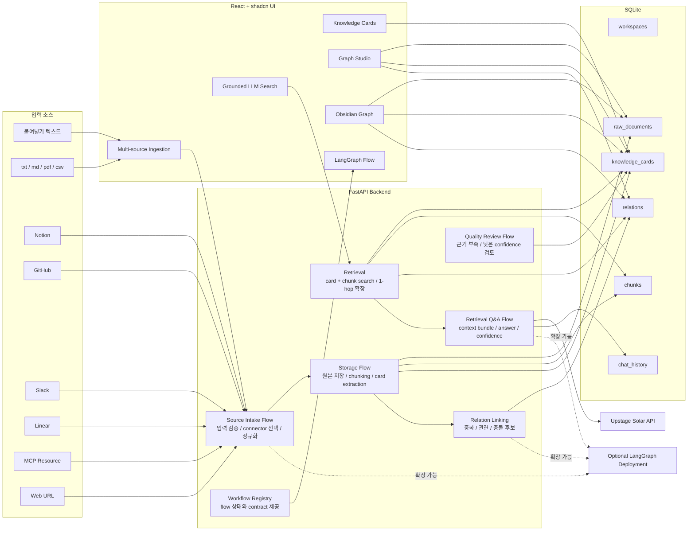

# Ideation Context Hub

흩어진 기획 자료를 `Raw Document -> Chunk -> Knowledge Card -> Relation` 구조로 저장하고, 나중에 질문하면 저장된 근거와 출처를 함께 꺼내는 아이디에이션 컨텍스트 허브예요.

이 프로젝트는 새로운 아이디어를 대신 만들어주는 도구가 아니라, 이미 회의록, AI 대화, 문서, 이슈, 피드백에 흩어진 **기획 맥락과 의사결정 근거를 팀 지식으로 바꾸는 도구**예요. 외부 소스에서 자료를 가져오고, 구조화해서 저장하고, 그래프와 Q&A로 다시 꺼내는 흐름을 구현했어요.

| 항목 | 현재 구현 |
|---|---|
| 백엔드 | FastAPI |
| 프론트엔드 | Vite React + shadcn UI |
| 영구 저장소 | SQLite |
| Workflow | LangGraph `StateGraph` |
| LLM 답변 | Upstage Solar API 기본, Claude/Codex OAuth 설정 확장 |
| 그래프 탐색 | 앱 내부 Graph Studio, Obsidian Graph 화면 |
| 외부 LangGraph | SDK adapter 준비, `graphs/qa_assistant`, `graphs/source_intake` 로컬 Studio app 제공 |

## 해결하려는 문제

| 실제 문제 | 구현한 해결 방식 | 관련 기능 |
|---|---|---|
| AI 대화, 회의록, Notion, GitHub 이슈가 흩어져 있어요 | 입력 소스를 하나의 Raw Document 형식으로 정규화해 저장해요 | Source Intake, Raw Document |
| “왜 이 결정을 했는지” 시간이 지나면 찾기 어려워요 | 카드마다 근거 문장, 출처 문서, source metadata를 함께 저장해요 | Knowledge Card, Evidence Quote |
| 같은 아이디어와 리스크를 반복해서 논의해요 | 신규 카드와 기존 카드 사이의 중복/관련/충돌 후보를 relation으로 연결해요 | Relation Linking |
| 가설, 근거, 결정사항이 문서 안에서 섞여 있어요 | 원문을 card_type, status, confidence가 있는 카드로 분해해요 | Card Extraction |
| 신규 팀원이 기획 맥락을 따라가기 어려워요 | 그래프 UI와 근거 기반 Q&A로 흐름을 탐색하게 해요 | Obsidian Graph, Grounded Search |
| 팀원이 각자 만든 LangGraph flow를 어디에 붙일지 헷갈려요 | flow registry와 연결 상태를 UI에서 보여줘요 | LangGraph Flow |

## 전체 아키텍처



## 연동 현황

| 연동 대상 | 현재 구현 수준 | 동작 방식 | 설정 |
|---|---|---|---|
| Upstage Solar | 구현됨 | Q&A context bundle을 Solar API에 보내 JSON 답변을 받아요 | `UPSTAGE_API_KEY` |
| Claude | client 구현됨 | provider를 `claude`로 바꾸면 Anthropic Messages API를 호출할 수 있어요 | `ICH_LLM_PROVIDER=claude`, `ANTHROPIC_API_KEY` |
| Codex/OpenAI OAuth | client 구현됨 | OAuth bearer token으로 OpenAI-compatible chat completion을 호출할 수 있어요 | `ICH_LLM_PROVIDER=codex_oauth`, `ICH_CODEX_OAUTH_TOKEN` |
| Notion | 구현됨 | page API와 block children API로 markdown-like text를 만들어요 | `ICH_NOTION_TOKEN` |
| GitHub | 구현됨 | file, raw URL, issue, pull request를 읽어요 | `ICH_GITHUB_TOKEN` |
| Slack | 구현됨 | thread replies를 transcript로 변환해요 | `ICH_SLACK_TOKEN` |
| Linear | 구현됨 | GraphQL로 issue, 상태, label, comment를 읽어요 | `ICH_LINEAR_TOKEN` |
| MCP | 구현됨 | Streamable HTTP endpoint의 `resources/read`를 호출해요 | `ICH_MCP_SERVER_URL`, `ICH_MCP_ACCESS_TOKEN` |
| Web URL | 구현됨 | HTML에서 script/style을 제외하고 읽을 수 있는 텍스트로 변환해요 | 없음 |
| LangGraph Platform | adapter 준비됨 | SDK로 deployment URL과 assistant id를 호출할 수 있어요 | `LANGGRAPH_DEPLOYMENT_URL`, `LANGSMITH_API_KEY` |

## 기술 구성과 책임

| 계층 | 사용 기술 | 맡는 일 |
|---|---|---|
| Frontend | Vite, React, shadcn UI, lucide-react | 자료 입력, 카드 목록, 그래프 탐색, 검색/Q&A 화면을 제공해요 |
| Backend API | FastAPI, Pydantic | workspace, document, card, relation, search, review API를 제공해요 |
| Workflow | LangGraph `StateGraph` | source intake, storage preprocessing, retrieval Q&A, quality review 순서를 노드 단위로 관리해요 |
| Storage | SQLite | 원본 문서, chunk, 카드, relation, Q&A history를 영구 저장해요 |
| Parsing | Python reader, pypdf, pandas | 텍스트, Markdown, PDF, CSV를 저장 가능한 텍스트로 변환해요 |
| Source Connector | httpx | Notion, GitHub, Slack, Linear, MCP, Web에서 읽기 전용으로 자료를 가져와요 |
| Retrieval | SQLite 기반 keyword/metadata search | 카드와 chunk를 검색하고 relation 1-hop context를 확장해요 |
| LLM | Upstage Solar, Claude client, Codex OAuth client | 근거 기반 답변과 품질 검토 설명 생성을 확장해요 |
| Graph UI | React SVG/canvas-style force simulation | 문서-카드-관계 노드를 Graph Studio와 Obsidian Graph로 보여줘요 |
| Dev Ops | npm scripts, uvicorn, langgraph-cli | 로컬 실행, 빌드, 테스트, LangGraph Studio 실행을 통합해요 |

## 코드 구조

| 경로 | 역할 |
|---|---|
| `app/api/` | FastAPI router가 모여 있어요 |
| `app/workflows/` | LangGraph `StateGraph` 기반 flow가 있어요 |
| `app/services/` | parsing, extraction, retrieval, source connector, relation, LLM adapter가 있어요 |
| `app/repositories/` | SQLite persistence 계층이에요 |
| `app/models/` | Pydantic schema와 도메인 상수예요 |
| `frontend/src/` | React 앱, 화면 컴포넌트, API client가 있어요 |
| `frontend/src/components/` | Graph Studio, Obsidian Graph, LangGraph Flow UI가 있어요 |
| `scripts/` | 로컬 실행, LangGraph 실행, smoke check helper가 있어요 |
| `tests/` | API, workflow, source connector, UI contract 회귀 테스트가 있어요 |
| `docs/` | PRD와 기획 문서가 있어요 |

## 현재 기능

| 기능 | 실제 동작 | 주요 위치 |
|---|---|---|
| Workspace 관리 | workspace 생성과 목록 조회를 해요 | `app/api/workspaces.py` |
| 파일 업로드 | `.txt`, `.md`, `.pdf`, `.csv`를 파싱해서 저장해요 | `app/api/documents.py`, `app/services/parsing.py` |
| 다중 소스 입력 | Notion, GitHub, Slack, Linear, MCP, Web 출처 메타데이터를 보존해요 | `app/workflows/source_intake.py` |
| 외부 소스 자동 가져오기 | content가 비어 있으면 서버 토큰으로 외부 자료를 읽어와요 | `app/services/source_connectors.py` |
| 원본 저장 | 입력 원문을 Raw Document로 그대로 저장해요 | `raw_documents` table |
| Chunk 생성 | 문서를 검색 가능한 chunk로 나눠요 | `app/services/chunking.py` |
| Knowledge Card 생성 | 규칙 기반 extractor가 아이디어, 가설, 근거, 리스크, 결정사항 등을 카드로 만들어요 | `app/services/extraction.py` |
| 카드 관계 생성 | 신규 카드와 기존 카드 사이의 관계 후보를 저장해요 | `app/services/relations.py` |
| 카드/문서 검색 | 카드와 chunk를 함께 검색해요 | `app/services/retrieval.py` |
| 근거 기반 Q&A | 검색된 카드, chunk, relation을 바탕으로 Upstage에 답변 생성을 요청해요 | `app/workflows/qa.py` |
| 품질 검토 | 근거 부족, 낮은 confidence, 검토 필요 카드를 찾아요 | `app/workflows/quality_review.py` |
| 그래프 UI | 문서-카드-관계 연결을 시각적으로 탐색해요 | `frontend/src/components/*Graph*.tsx` |
| LangGraph Flow UI | flow 상태, 담당자, input/output contract를 보여줘요 | `app/workflows/registry.py` |

## 빠른 실행

| 목적 | 명령어 | 접속 주소 |
|---|---|---|
| 전체 의존성 설치 | `npm run setup` | - |
| 전체 앱 실행 | `npm run dev` | `http://127.0.0.1:5173` |
| LangGraph 없이 웹 앱 실행 | `npm run dev:web` | `http://127.0.0.1:5173` |
| FastAPI만 실행 | `npm run backend:dev` | `http://127.0.0.1:8000` |
| Vite만 실행 | `npm run frontend:dev` | `http://127.0.0.1:5173` |
| 빌드된 화면을 FastAPI에서 제공 | `npm run frontend:build` 후 `npm run backend:dev` | `http://127.0.0.1:8000` |

처음 실행할 때는 아래 순서가 가장 단순해요.

```powershell
npm run setup
npm run dev
```

개발 중에는 Vite가 `/api`와 `/health` 요청을 `http://127.0.0.1:8000`으로 proxy해요. 그래서 `http://127.0.0.1:5173`만 열어도 프론트와 API를 함께 확인할 수 있어요.

## npm 명령어

| 명령어 | 설명 | 비고 |
|---|---|---|
| `npm run setup` | Python, frontend, LangGraph CLI 의존성을 한 번에 설치해요 | 첫 실행 권장 |
| `npm run setup:python` | `requirements.txt`만 설치해요 | 백엔드 의존성 |
| `npm run setup:frontend` | `frontend` npm 패키지만 설치해요 | Vite/React 의존성 |
| `npm run setup:langgraph` | `langgraph-cli[inmem]`와 graph별 의존성을 설치해요 | 현재 등록된 graph 의존성도 함께 설치해요 |
| `npm run dev` | FastAPI, Vite, 등록된 LangGraph app을 함께 실행해요 | `graphs/qa_assistant`, `graphs/source_intake`가 함께 떠요 |
| `npm run dev:web` | FastAPI와 Vite만 실행해요 | LangGraph 로컬 서버 제외 |
| `npm run dev:langgraph` | `graphs/*/langgraph.json` 전체를 실행해요 | Studio 확인용 |
| `npm run backend:dev` | FastAPI 개발 서버를 실행해요 | `127.0.0.1:8000` |
| `npm run frontend:dev` | Vite 개발 서버를 실행해요 | `127.0.0.1:5173` |
| `npm run test` | 전체 pytest를 실행해요 | `backend:test`와 동일 |
| `npm run backend:test` | 전체 pytest를 실행해요 | 백엔드 회귀 테스트 |
| `npm run frontend:lint` | frontend ESLint를 실행해요 | `frontend/src` 대상 |
| `npm run build` | frontend production build를 실행해요 | `frontend/dist` 생성 |
| `npm run frontend:build` | frontend production build를 실행해요 | `build`와 동일 |
| `npm run langgraph:list` | 등록된 로컬 LangGraph app 목록을 보여줘요 | `graphs/<name>/langgraph.json` 기준 |
| `npm run langgraph:dev` | 등록된 모든 LangGraph app을 실행해요 | 2024 포트부터 순서대로 사용 |
| `npm run langgraph:dev:qa` | `qa_assistant` app만 실행해요 | 해당 폴더가 없으면 안내 후 종료 |

## 사용 흐름

| 단계 | 사용자가 하는 일 | 시스템이 하는 일 |
|---|---|---|
| 1 | workspace를 만들거나 선택해요 | workspace 기준으로 문서, 카드, 관계를 분리해요 |
| 2 | 파일을 업로드하거나 외부 소스 URL과 metadata를 입력해요 | Source Intake Flow가 입력을 검증하고 공통 문서 형식으로 정규화해요 |
| 3 | 저장 요청을 실행해요 | 원본 저장, chunking, Knowledge Card 추출, relation 후보 생성을 이어서 처리해요 |
| 4 | Knowledge Cards를 확인해요 | card_type, status, confidence, evidence_quote를 보여줘요 |
| 5 | Graph Studio 또는 Obsidian Graph를 열어요 | Raw Document, Card, Relation 연결을 시각화해요 |
| 6 | 질문을 입력해요 | card/chunk 검색, 1-hop 관계 확장, Upstage 기반 답변 생성을 실행해요 |
| 7 | 품질 검토를 실행해요 | 근거 부족, 낮은 confidence, needs_review 카드를 검토 후보로 모아요 |

## 화면 구성

| 화면 | 할 수 있는 일 |
|---|---|
| Workspace / Source 입력 | workspace 생성, 소스 타입 선택, 텍스트 붙여넣기, 파일 업로드를 해요 |
| Knowledge Cards | 추출된 카드의 타입, 상태, confidence, 키워드, 근거 문장을 확인해요 |
| Graph Studio | Raw Document, Knowledge Card, Relation을 시스템 관점으로 확인해요 |
| Obsidian Graph | 노드 drag, zoom, pan, search, local depth, 그룹 토글로 관계를 탐색해요 |
| LangGraph Flow | Source Intake, Storage, Relation Linking, Retrieval Q&A, Quality Review 흐름을 확인해요 |
| Grounded LLM Search | 질문을 입력하고 검색 결과, 답변, 근거 카드, 원문 chunk를 확인해요 |

## 지원 입력 형식과 입력 소스

| 소스 | 입력 방식 | 자동 가져오기 조건 | 필요한 환경 변수 |
|---|---|---|---|
| 직접 입력 | 텍스트 붙여넣기 | 없음 | 없음 |
| 파일 업로드 | `.txt`, `.md`, `.pdf`, `.csv` | 없음 | 없음 |
| Notion | page URL 또는 page id | content가 비어 있을 때 Notion API 호출 | `ICH_NOTION_TOKEN` |
| GitHub | blob, raw, issue, pull request URL | content가 비어 있을 때 GitHub API 호출 | `ICH_GITHUB_TOKEN` |
| Slack | thread URL, `slack://channels/{channel}/{ts}`, `channel:ts` | content가 비어 있을 때 Slack API 호출 | `ICH_SLACK_TOKEN` |
| Linear | issue URL, issue identifier, issue id | content가 비어 있을 때 Linear GraphQL 호출 | `ICH_LINEAR_TOKEN` |
| MCP | resource URI | content가 비어 있을 때 `resources/read` 호출 | `ICH_MCP_SERVER_URL`, `ICH_MCP_ACCESS_TOKEN` |
| Web | `http` 또는 `https` URL | content가 비어 있을 때 HTML을 텍스트로 변환 | 없음 |

입력 우선순위는 아래와 같아요.

- content가 있으면 붙여넣은 내용을 우선 저장해요.
- content가 없으면 source connector로 자동 가져오기를 시도해요.
- source token이 없거나 URL 형식이 맞지 않으면 400 또는 502로 실패 이유를 반환해요.

## Knowledge Card

현재 카드 추출은 규칙 기반으로 동작해요. LLM 없이도 로컬에서 안정적으로 저장 흐름을 확인할 수 있게 하기 위한 구현이에요.

| 원문 marker | card_type | 기본 status | 기본 confidence |
|---|---|---|---|
| `아이디어`, `idea` | `idea` | `proposed` | `medium` |
| `가설`, `hypothesis` | `hypothesis` | `needs_validation` | `medium` |
| `근거`, `evidence` | `evidence` | `validated` | `high` |
| `리스크`, `위험`, `risk` | `risk` | `needs_validation` | `medium` |
| `결정`, `decision` | `decision` | `decided` | `high` |
| `문제` | `problem` | `proposed` | `medium` |
| `타깃`, `사용자` | `target_user` | `proposed` | `medium` |
| `기능` | `feature` | `proposed` | `medium` |
| `질문` 또는 분류 실패 | `question` | `needs_review` | `low` |

예시 입력이에요.

```text
결정: MVP에서는 GraphDB 대신 SQLite relation 테이블을 사용한다.
근거: 2주 안에 Neo4j를 운영하면 쿼리 설계와 배포 리스크가 크다.
리스크: 관계가 많아지면 multi-hop 탐색 성능이 떨어질 수 있다.
```

## 저장 구조

| 데이터 | 설명 | SQLite table |
|---|---|---|
| Workspace | 사용자가 작업하는 프로젝트 공간이에요 | `workspaces` |
| Raw Document | 업로드하거나 가져온 원문이에요 | `raw_documents` |
| Chunk | 검색과 카드 추출을 위한 원문 조각이에요 | `chunks` |
| Knowledge Card | 아이디어, 가설, 근거, 리스크, 결정사항 같은 구조화 정보예요 | `knowledge_cards` |
| Relation | 카드 간 관계 후보예요 | `relations` |
| Chat History | Q&A 질문, 답변, 참조 카드/chunk 기록이에요 | `chat_history` |

관계 타입은 아래 값을 사용해요.

| relation_type | 의미 |
|---|---|
| `supports` | 한 카드가 다른 카드를 뒷받침해요 |
| `contradicts` | 두 카드가 서로 충돌할 수 있어요 |
| `duplicates` | 유사하거나 중복된 카드예요 |
| `related_to` | 주제가 관련되어 있어요 |
| `derived_from` | 한 카드가 다른 카드에서 파생됐어요 |

## 검색과 Q&A

| 기능 | 실제 동작 |
|---|---|
| 일반 검색 | `RetrievalService`가 카드와 chunk를 같이 검색해요 |
| 1-hop 확장 | 검색된 카드와 직접 연결된 relation, neighbor card를 함께 묶어요 |
| multi-hop 조회 | 카드 상세 API에서 제한된 경로 탐색을 제공해요 |
| Q&A 답변 생성 | `UPSTAGE_API_KEY`가 있으면 Solar API로 JSON 답변을 생성해요 |
| 키가 없을 때 | 근거는 검색되지만 답변은 `UPSTAGE_API_KEY가 설정되지 않았습니다.`로 표시돼요 |
| 답변 저장 | 질문, 답변, 참조 카드/chunk id를 `chat_history`에 저장해요 |

Q&A는 저장된 카드, chunk, relation context를 기반으로만 답변하도록 구성되어 있어요. 저장된 근거가 부족하면 부족하다고 표시해요.

## LangGraph 붙이는 방식

이 프로젝트에서 LangGraph는 두 가지 층으로 나뉘어요.

| 구분 | 현재 상태 | 설명 |
|---|---|---|
| 앱 내부 `StateGraph` | 구현됨 | Source Intake, Storage, Retrieval Q&A, Quality Review 흐름을 코드 안에서 실행해요 |
| 앱 내부 Flow UI | 구현됨 | `/api/workflows` registry를 프론트에서 보여줘요 |
| 외부 LangGraph SDK adapter | 준비됨 | `app/services/langgraph_remote.py`에서 LangGraph deployment를 호출할 수 있어요 |
| 로컬 LangGraph Studio app | 구현됨 | `graphs/qa_assistant`, `graphs/source_intake`를 `npm run langgraph:dev`로 실행하고 Studio에서 확인해요 |

현재 workflow registry예요.

| Flow | 상태 | 주요 노드 | 위치 |
|---|---|---|---|
| Source Intake Flow | `implemented` | `validate_input`, `select_connector`, `fetch_external_content`, `normalize_document`, `finalize` | `app/workflows/source_intake.py` |
| Storage Preprocessing Flow | `implemented` | `save_raw_document`, `chunk_document`, `extract_cards`, `finalize` | `app/workflows/storage.py` |
| Relation Linking Flow | `extension_slot` | `remote:relation_linking` | 현재 local detector 사용, remote 확장 자리 |
| Retrieval Q&A Flow | `implemented` | `retrieve_context`, `expand_context`, `format_context`, `generate_answer`, `assess_and_finalize` | `app/workflows/qa.py` |
| Quality Review Flow | `implemented` | `collect_candidates`, `analyze_cards`, `update_statuses`, `generate_summary` | `app/workflows/quality_review.py` |

현재 등록된 로컬 LangGraph app은 아래 명령으로 확인해요.

```powershell
npm run langgraph:list
```

현재 목록이에요.

| Graph app | 역할 | 위치 |
|---|---|---|
| `qa_assistant` | Q&A context를 답변 생성 flow로 실행해요 | `graphs/qa_assistant` |
| `source_intake` | 외부/수동 입력을 공통 source intake flow로 정규화해요 | `graphs/source_intake` |

새로운 외부 LangGraph app을 추가하려면 아래 구조를 맞춰요.

```text
graphs/
  qa_assistant/
    langgraph.json
    requirements.txt
    .env.example
    qa_assistant/
      graph.py
```

실행해요.

```powershell
npm run langgraph:dev
```

Studio 주소는 실행 로그에 표시돼요. 기본 포트는 `2024`부터 사용해요.

## 환경 변수

로컬 실행과 테스트는 유료 API Key 없이도 가능해요. 외부 LLM 답변, source 자동 가져오기, 외부 LangGraph 연결이 필요할 때만 `.env`에 값을 넣어요.

```powershell
Copy-Item .env.example .env
```

| 변수 | 용도 | 필수 여부 |
|---|---|---|
| `ICH_DATABASE_URL` | SQLite 경로예요. 기본값은 `sqlite:///./data/ideation_context_hub.sqlite3`예요 | 선택 |
| `UPSTAGE_API_KEY` 또는 `ICH_UPSTAGE_API_KEY` | Upstage Solar 답변 생성에 사용해요 | Q&A 답변 생성 시 필요 |
| `ICH_LLM_PROVIDER` | `auto`, `upstage`, `claude`, `codex_oauth`, `local`, `none` 중 선택해요 | 선택 |
| `ANTHROPIC_API_KEY` 또는 `ICH_CLAUDE_API_KEY` | Claude provider 설정에 사용해요 | Claude 사용 시 필요 |
| `ICH_CODEX_OAUTH_TOKEN` | Codex/OpenAI OAuth bearer token provider에 사용해요 | Codex OAuth 사용 시 필요 |
| `ICH_NOTION_TOKEN` | Notion page 자동 가져오기에 사용해요 | Notion 자동 fetch 시 필요 |
| `ICH_GITHUB_TOKEN` | GitHub file/issue/pull 자동 가져오기에 사용해요 | GitHub 자동 fetch 시 필요 |
| `ICH_SLACK_TOKEN` | Slack thread 자동 가져오기에 사용해요 | Slack 자동 fetch 시 필요 |
| `ICH_LINEAR_TOKEN` | Linear issue 자동 가져오기에 사용해요 | Linear 자동 fetch 시 필요 |
| `ICH_MCP_SERVER_URL` | MCP Streamable HTTP endpoint예요 | MCP 자동 fetch 시 필요 |
| `ICH_MCP_ACCESS_TOKEN` | MCP endpoint bearer token이에요 | MCP 자동 fetch 시 필요 |
| `LANGGRAPH_DEPLOYMENT_URL` 또는 `ICH_LANGGRAPH_DEPLOYMENT_URL` | 외부 LangGraph deployment URL이에요 | 외부 LangGraph 호출 시 필요 |
| `LANGSMITH_API_KEY` 또는 `ICH_LANGSMITH_API_KEY` | LangGraph SDK 호출 인증에 사용해요 | 외부 LangGraph 호출 시 필요 |
| `LANGGRAPH_QA_ASSISTANT_ID` 또는 `ICH_LANGGRAPH_QA_ASSISTANT_ID` | 외부 Q&A assistant id예요 | 외부 Q&A graph 사용 시 필요 |
| `LANGGRAPH_REVIEW_ASSISTANT_ID` 또는 `ICH_LANGGRAPH_REVIEW_ASSISTANT_ID` | 외부 review assistant id예요 | 외부 review graph 사용 시 필요 |

## API 요약

FastAPI 문서는 서버 실행 후 아래에서 확인해요.

```text
http://127.0.0.1:8000/docs
```

| Method | Path | 설명 |
|---|---|---|
| `GET` | `/health` | 서버 상태를 확인해요 |
| `POST` | `/api/workspaces` | workspace를 생성해요 |
| `GET` | `/api/workspaces` | workspace 목록을 조회해요 |
| `POST` | `/api/workspaces/{workspace_id}/documents/text` | 텍스트를 저장해요 |
| `POST` | `/api/workspaces/{workspace_id}/documents/upload` | 파일을 업로드해 저장해요 |
| `POST` | `/api/workspaces/{workspace_id}/documents/source` | 출처 metadata와 함께 텍스트 또는 외부 링크를 저장해요 |
| `GET` | `/api/workspaces/{workspace_id}/documents` | 원본 문서 목록을 조회해요 |
| `GET` | `/api/workspaces/{workspace_id}/documents/{document_id}` | 원본 문서 상세를 조회해요 |
| `GET` | `/api/workspaces/{workspace_id}/cards` | 카드 목록을 조회해요 |
| `GET` | `/api/workspaces/{workspace_id}/cards/{card_id}` | 카드 상세를 조회해요 |
| `PATCH` | `/api/workspaces/{workspace_id}/cards/{card_id}` | 카드 상태 또는 태그를 수정해요 |
| `GET` | `/api/workspaces/{workspace_id}/cards/{card_id}/relations` | 카드의 1-hop 관계를 조회해요 |
| `GET` | `/api/workspaces/{workspace_id}/cards/{card_id}/paths` | 제한된 multi-hop 경로를 조회해요 |
| `GET` | `/api/workspaces/{workspace_id}/search?q=...` | 카드와 chunk를 검색해요 |
| `POST` | `/api/workspaces/{workspace_id}/search/llm` | 검색 결과 기반 답변을 생성해요 |
| `POST` | `/api/workspaces/{workspace_id}/qa` | 근거 기반 Q&A를 실행해요 |
| `GET` | `/api/workspaces/{workspace_id}/qa/history` | Q&A 이력을 조회해요 |
| `POST` | `/api/workspaces/{workspace_id}/reviews/run` | 품질 검토 flow를 실행해요 |
| `GET` | `/api/workspaces/{workspace_id}/graph` | 그래프 화면용 노드와 링크를 조회해요 |
| `GET` | `/api/workflows` | LangGraph Flow registry를 조회해요 |

## 검증

커밋 전에는 아래를 기준으로 확인해요.

| 검증 | 명령어 |
|---|---|
| 전체 백엔드 테스트 | `npm run test` |
| 프론트엔드 lint | `npm run frontend:lint` |
| 프론트엔드 빌드 | `npm run frontend:build` |
| LangGraph app 목록 | `npm run langgraph:list` |

브라우저에서는 아래를 확인해요.

- `http://127.0.0.1:5173`에서 화면이 열리는지 확인해요.
- workspace 생성과 source 입력이 되는지 확인해요.
- 파일 업로드와 붙여넣기 저장이 되는지 확인해요.
- Knowledge Card가 생성되는지 확인해요.
- Graph Studio와 Obsidian Graph에서 노드가 보이는지 확인해요.
- Grounded LLM Search가 카드, chunk, relation 근거를 표시하는지 확인해요.

## 배포 방향

현재 코드는 로컬 실행과 SQLite 저장을 기준으로 해요. Cloudflare로 옮길 때는 아래처럼 단계적으로 가는 것이 안전해요.

| 단계 | 권장 방식 | 이유 |
|---|---|---|
| 1 | Cloudflare Pages에 `frontend/dist` 배포 | 가장 빨리 화면을 외부에 공개할 수 있어요 |
| 2 | FastAPI는 별도 Python 호스팅 또는 Tunnel로 유지 | 현재 Python 로직을 유지할 수 있어요 |
| 3 | SQLite repository 추상화 유지 후 D1 adapter 추가 | schema를 크게 바꾸지 않고 이관할 수 있어요 |
| 4 | 원본 파일은 R2, metadata는 D1에 저장 | 큰 파일을 DB에 직접 넣지 않게 돼요 |
| 5 | vector 검색이 필요해지면 Vectorize 또는 Supabase pgvector 검토 | 카드 수와 검색 요구가 커질 때 판단해요 |

민감 정보는 Git에 올리지 않아요.

- 로컬: `.env` 사용
- Cloudflare: `wrangler secret put ...` 사용
- Git ignore 대상: `.env`, `.dev.vars`, `data/`, `*.sqlite3`, `*.db`

## 개인정보 주의

이 앱은 원본 문서를 출처 추적을 위해 저장해요. 회의록, 인터뷰 메모, AI 대화에는 개인정보나 외부 비밀 정보가 포함될 수 있으므로 업로드 전 확인이 필요해요.

현재 범위에는 조직 단위 권한 관리, 자동 비식별화, 감사 로그 정책은 포함되어 있지 않아요.
